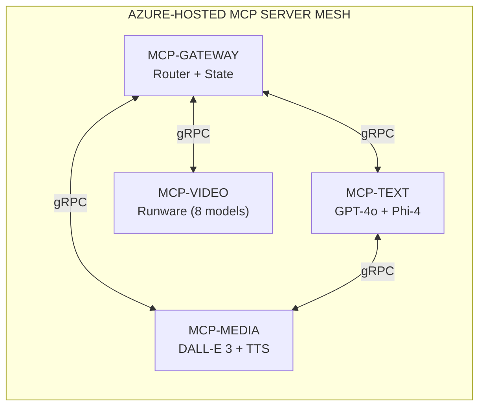
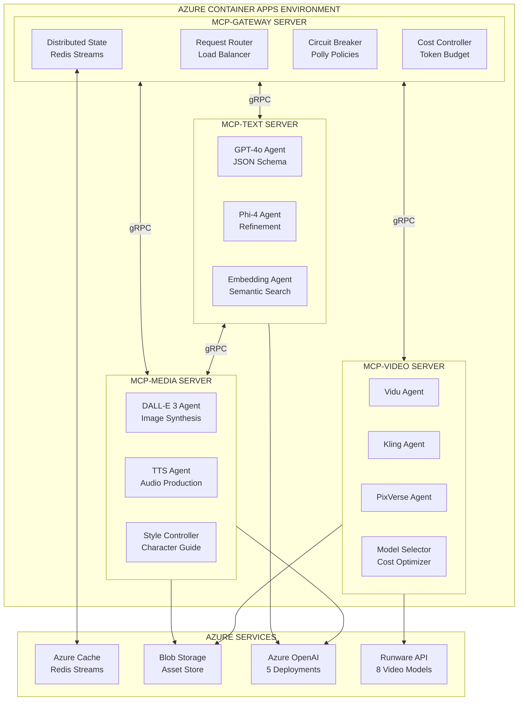
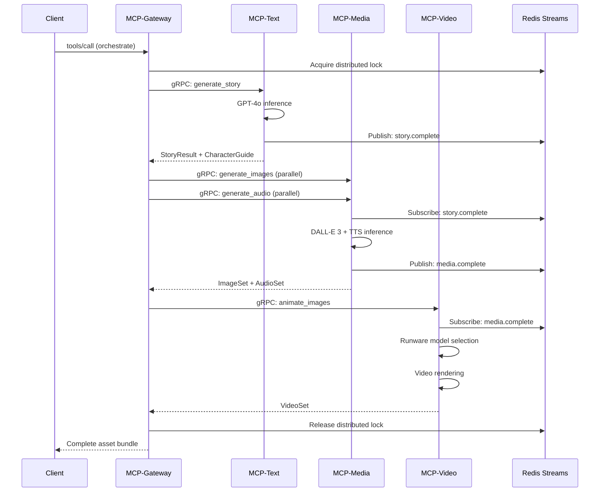
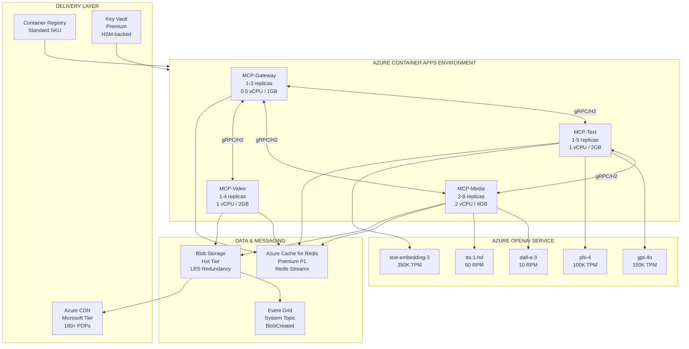
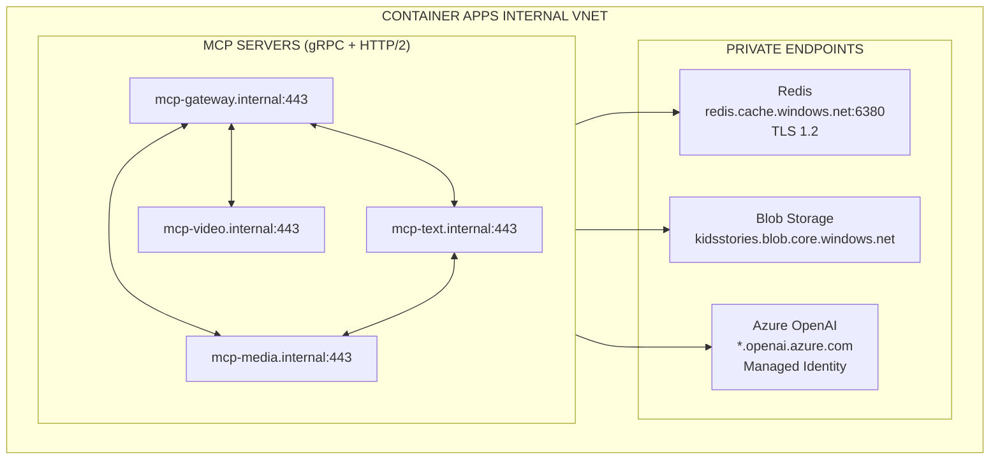

# KidsStories.AI — Distributed MCP Server Architecture

A production-grade demonstration of **end-to-end autonomous product delivery** — where AI generates content, synthesizes images, produces audio, renders video, uploads assets to cloud storage, triggers CI/CD pipelines, deploys container revisions, and purges CDN cache — **all autonomously, daily, with zero manual steps**.

Built on a **distributed MCP (Model Context Protocol) server mesh** hosted in Azure, with inter-server communication via gRPC and shared state propagation across 5 specialized AI agents. The architecture demonstrates how multiple MCP servers can coordinate complex multi-modal AI workflows while maintaining consistency, fault tolerance, and cost efficiency.

**Live Demo:** https://thekidsstorytime.com/

---

## Table of Contents

1. [Problems Solved](#problems-solved)
2. [Distributed MCP Server Architecture](#distributed-mcp-server-architecture)
3. [Inter-Server Communication Protocol](#inter-server-communication-protocol)
4. [AI Model Orchestration](#ai-model-orchestration)
5. [Autonomous Pipeline](#autonomous-pipeline)
6. [Azure Infrastructure](#azure-infrastructure)
7. [Implementation Details](#implementation-details)
8. [Performance Metrics](#performance-metrics)

---

## Problems Solved

### The Challenge: Multi-Modal AI Coordination at Scale

Traditional AI integrations suffer from:

| Problem | Impact | Our Solution |
|---------|--------|--------------|
| **Point-to-Point Integrations** | N² complexity, brittle connections, no shared state | Distributed MCP mesh with centralized state propagation |
| **Model Inconsistency** | Character appearance drift, narrative discontinuity | Cross-server context sharing via gRPC streaming |
| **Manual Deployment** | Human bottleneck, delayed releases, error-prone | Event-driven pipeline with zero-touch deployment |
| **Cost Overruns** | Uncontrolled token consumption, no budget enforcement | Real-time cost tracking with automatic model tier adjustment |
| **Single Points of Failure** | One model failure cascades to entire system | Circuit breaker patterns with automatic failover routing |
| **Scaling Complexity** | Monolithic AI services don't scale independently | Horizontally scalable MCP servers per capability domain |

### The Innovation: Distributed MCP Server Mesh

Instead of a single orchestrator, KidsStories deploys **multiple specialized MCP servers** that communicate with each other:



Each MCP server:
- Runs as an independent Azure Container Apps instance
- Exposes MCP protocol endpoints over HTTP/2 + gRPC
- Maintains local state with distributed sync via Redis Streams
- Implements domain-specific AI tool definitions
- Participates in mesh-wide circuit breaker coordination

---

## Distributed MCP Server Architecture

### Multi-Server Topology



### MCP Server Specifications

| Server | Azure Container Apps | Replicas | Tools Exposed | Primary Function |
|--------|---------------------|----------|---------------|------------------|
| **MCP-Gateway** | `mcp-gateway.azurecontainerapps.io` | 1-3 | `orchestrate`, `route`, `budget` | Request routing, state coordination, cost control |
| **MCP-Text** | `mcp-text.azurecontainerapps.io` | 1-5 | `generate_story`, `refine_text`, `embed` | Narrative generation, readability optimization |
| **MCP-Media** | `mcp-media.azurecontainerapps.io` | 2-8 | `generate_image`, `generate_audio`, `apply_style` | Image synthesis, TTS, character consistency |
| **MCP-Video** | `mcp-video.azurecontainerapps.io` | 1-4 | `animate_image`, `select_model`, `render` | Cost-optimized video animation |

### Why Distributed MCP Servers?

**Single MCP Server Limitations:**
- Vertical scaling only (memory/CPU bound)
- Single point of failure for all AI operations
- No isolation between model domains
- Shared rate limits cause contention

**Distributed MCP Server Benefits:**
- Horizontal scaling per capability domain
- Fault isolation (video failure doesn't affect text)
- Independent rate limit pools per server
- Specialized optimization per AI modality
- Parallel processing across server boundaries

---

## Inter-Server Communication Protocol

### gRPC-Based MCP Mesh Communication



### State Propagation Mechanism

| State Type | Sharing Method | TTL | Purpose |
|------------|----------------|-----|---------|
| **Character Guide** | Redis Hash + gRPC payload | 24h | Ensures visual consistency across DALL-E calls |
| **Style Tokens** | Redis Streams pub/sub | Session | Maintains narrative tone across pages |
| **Cost Accumulator** | Redis Sorted Set | 1h | Real-time token budget tracking |
| **Circuit State** | Redis Pub/Sub | 30s | Mesh-wide failure propagation |
| **Request Context** | gRPC metadata | Request | Correlation ID, trace context, auth tokens |

### Distributed Lock Protocol

```
1. Gateway acquires Redis SETNX lock: `generation:{date}:{ageBand}`
2. Lock includes: TTL=300s, owner=gateway-instance-id
3. On timeout: Automatic release + dead letter queue
4. On success: Explicit UNLOCK with verification
5. Contention: Exponential backoff with jitter (50ms → 800ms)
```

---

## AI Model Orchestration

### Model Stack

| Model | Provider | Input | Output | Purpose |
|-------|----------|-------|--------|---------|
| **GPT-4o** | Azure OpenAI | Story parameters (102 configurable params) | JSON w/ narratives, characters | Structured content generation |
| **DALL-E 3** | Azure OpenAI | Character guide + scene description | PNG 1024×1024 | Character-consistent illustrations |
| **GPT-4o-mini-TTS** | Azure OpenAI | Story text + narrative style | MP3 24kHz mono | Neural text-to-speech narration |
| **Phi-4 Multimodal** | Azure AI | Generated text | Refined text | Readability optimization & Flesch-Kincaid tuning |
| **Vidu / Kling / PixVerse** | Runware | PNG image + motion hints | MP4 5-10s | Cost-optimized video animation (8 models) |

### Generation Parameters

**Total: 102+ Configurable Parameters**

| Category | Count | Examples |
|----------|-------|----------|
| **Narrative Control** | 12 | `page_count`, `word_range`, `reading_level`, `json_schema`, `sentence_structure` |
| **Entity Design** | 15 | `personality_traits`, `physical_features`, `clothing_spec`, `color_palette`, `distinctive_marks` |
| **Theme Selection** | 8 | `genre_weight`, `location_type`, `action_verbs`, `goal_templates`, `seasonal_context` |
| **Variation Engine** | 7 | `repetition_window_days`, `history_hash`, `uniqueness_threshold`, `semantic_distance` |
| **LLM Tuning** | 5 | `temperature`, `top_p`, `presence_penalty`, `frequency_penalty`, `max_tokens` |
| **Image Synthesis** | 28 | `style_prompt`, `character_guide`, `composition_rules`, `color_enforcement`, `size_spec` |
| **Audio Production** | 11 | `voice_id`, `sample_rate`, `emotion_mapping`, `pacing_multiplier`, `expression_intensity` |
| **Video Animation** | 16 | `motion_type`, `duration_sec`, `model_tier`, `cost_ceiling`, `quality_preset` |

---

## Autonomous Pipeline

### Event-Driven Architecture

```mermaid
graph LR
    subgraph SYNTH["PHASE 1: DISTRIBUTED AI SYNTHESIS"]
        direction TB
        TXT["MCP-Text<br/>GPT-4o → JSON<br/>Phi-4 → Refine"]
        IMG["MCP-Media<br/>DALL-E 3 → PNG<br/>Style Controller"]
        AUD["MCP-Media<br/>TTS → MP3<br/>Voice Profile"]
        VID["MCP-Video<br/>Runware → MP4<br/>Model Selection"]
    end
    
    subgraph UPLOAD["PHASE 2: CLOUD SYNC"]
        direction TB
        HASH["Content Hash<br/>SHA-256 Dedupe"]
        HIER["Hierarchical Upload<br/>stories/{date}/{age}/"]
        META["Manifest Build<br/>story-manifest.json"]
    end
    
    subgraph DEPLOY["PHASE 3: ZERO-TOUCH DEPLOY"]
        direction TB
        EVT["Event Grid<br/>BlobCreated Trigger"]
        GH["GitHub Actions<br/>Webhook Receiver"]
        DOCK["Docker Build<br/>Multi-Stage"]
        ACR["ACR Push<br/>Tagged Image"]
        CONT["Container Apps<br/>Blue-Green Revision"]
        CDN["CDN Purge<br/>180+ Edge POPs"]
    end
    
    TXT -->|gRPC| IMG
    TXT -->|gRPC| AUD
    IMG -->|gRPC| VID
    AUD --> VID
    
    VID --> HASH
    HASH --> HIER
    HIER --> META
    
    META --> EVT
    EVT -->|HTTP POST| GH
    GH --> DOCK
    DOCK --> ACR
    ACR --> CONT
    CONT --> CDN
```



### Pipeline Execution Timeline

| Phase | Step | Trigger | Technical Action | Latency |
|-------|------|---------|------------------|---------|
| **AI** | 1 | Cron 00:00 UTC | MCP-Gateway receives `tools/call orchestrate` | 0ms |
| **AI** | 2 | Gateway routing | MCP-Text: GPT-4o inference with JSON schema mode | ~3s |
| **AI** | 3 | Redis: story.complete | MCP-Text: Phi-4 Flesch-Kincaid optimization | ~1s |
| **AI** | 4 | gRPC stream | MCP-Media: DALL-E 3 parallel image synthesis (N pages) | ~8s×N |
| **AI** | 5 | gRPC stream | MCP-Media: GPT-4o-mini-TTS parallel audio | ~2s×N |
| **AI** | 6 | Redis: media.complete | MCP-Video: Runware model selection + rendering | ~45s×K |
| **Cloud** | 7 | Asset bundle ready | SHA-256 content hash generation | ~100ms |
| **Cloud** | 8 | Hash comparison | Skip upload if blob exists with matching hash | ~50ms |
| **Cloud** | 9 | New content detected | Azure Blob SDK parallel upload (4 concurrent) | ~30s |
| **Cloud** | 10 | Upload complete | Query blob metadata, rebuild `story-manifest.json` | ~5s |
| **Trigger** | 11 | BlobCreated event | Event Grid → GitHub webhook (HTTP POST) | <100ms |
| **CI/CD** | 12 | Workflow dispatch | `actions/checkout` + `npm run build` (Next.js SSG) | ~90s |
| **CI/CD** | 13 | Build artifacts | Docker multi-stage: `node:alpine` → `nginx:alpine` | ~45s |
| **CI/CD** | 14 | Image ready | `docker push` to ACR with `latest` + SHA tag | ~30s |
| **Deploy** | 15 | ACR webhook | `az containerapp update --image` (new revision) | ~60s |
| **Deploy** | 16 | Health check pass | Traffic shift: 0% → 100% to new revision | ~10s |
| **CDN** | 17 | Deploy success | `az cdn endpoint purge --content-paths "/*"` | <5s |

**Total: ~4 minutes from generation trigger to global availability**

---

## Azure Infrastructure

### Multi-MCP Server Hosting Architecture



### Container Apps Configuration

| MCP Server | Resource Allocation | Scaling Rule | KEDA Trigger |
|------------|---------------------|--------------|--------------|
| **MCP-Gateway** | 0.5 vCPU, 1GB RAM | 1→3 replicas | HTTP concurrent requests > 50 |
| **MCP-Text** | 1 vCPU, 2GB RAM | 1→5 replicas | Redis queue length > 10 |
| **MCP-Media** | 2 vCPU, 4GB RAM | 2→8 replicas | Redis queue length > 5 |
| **MCP-Video** | 1 vCPU, 2GB RAM | 1→4 replicas | Redis queue length > 3 |

### Azure OpenAI Deployments

| Deployment | Model | Region | TPM/RPM | Purpose |
|------------|-------|--------|---------|---------|
| `gpt-4o-prod` | gpt-4o-2024-08-06 | East US 2 | 150K TPM | Primary narrative generation |
| `dalle-3-prod` | dall-e-3 | Sweden Central | 10 RPM | Image synthesis |
| `tts-hd-prod` | tts-1-hd | East US | 50 RPM | Audio narration |
| `phi-4-prod` | phi-4 | East US 2 | 100K TPM | Text refinement |
| `embed-prod` | text-embedding-3-large | East US | 350K TPM | Semantic deduplication |

### Service Mesh Networking



---

## Implementation Details

### MCP Tool Definitions

Each MCP server exposes domain-specific tools via the Model Context Protocol:

**MCP-Gateway Tools:**
```json
{
  "tools": [
    { "name": "orchestrate", "description": "Coordinate multi-server generation workflow" },
    { "name": "route", "description": "Intelligent request routing with failover" },
    { "name": "budget_check", "description": "Real-time token budget validation" },
    { "name": "circuit_status", "description": "Mesh-wide circuit breaker state" }
  ]
}
```

**MCP-Text Tools:**
```json
{
  "tools": [
    { "name": "generate_story", "description": "GPT-4o structured narrative generation" },
    { "name": "refine_readability", "description": "Phi-4 Flesch-Kincaid optimization" },
    { "name": "embed_content", "description": "Semantic embedding for deduplication" }
  ]
}
```

**MCP-Media Tools:**
```json
{
  "tools": [
    { "name": "generate_image", "description": "DALL-E 3 character-consistent synthesis" },
    { "name": "generate_audio", "description": "TTS neural narration production" },
    { "name": "apply_character_guide", "description": "Visual consistency enforcement" }
  ]
}
```

**MCP-Video Tools:**
```json
{
  "tools": [
    { "name": "select_model", "description": "Cost-optimized Runware model selection" },
    { "name": "animate_image", "description": "Image-to-video rendering" },
    { "name": "batch_render", "description": "Parallel video processing" }
  ]
}
```

### Circuit Breaker Configuration

```csharp
// Polly circuit breaker policy per MCP server
services.AddResiliencePipeline("mcp-media", builder =>
{
    builder
        .AddCircuitBreaker(new CircuitBreakerStrategyOptions
        {
            FailureRatio = 0.5,
            SamplingDuration = TimeSpan.FromSeconds(30),
            MinimumThroughput = 10,
            BreakDuration = TimeSpan.FromSeconds(60),
            OnOpened = args => PublishToRedis("circuit.opened", "mcp-media")
        })
        .AddRetry(new RetryStrategyOptions
        {
            MaxRetryAttempts = 3,
            BackoffType = DelayBackoffType.Exponential,
            Delay = TimeSpan.FromMilliseconds(500)
        });
});
```

### Failure Handling Matrix

| Failure Type | Detection | Recovery | Fallback |
|--------------|-----------|----------|----------|
| **MCP-Text timeout** | gRPC deadline exceeded | Retry 3x with exponential backoff | Queue to dead letter |
| **MCP-Media 5xx** | HTTP status code | Route to replica | Reduce image quality tier |
| **MCP-Video rate limit** | 429 response | Backoff + model switch | Select cheaper Runware model |
| **Redis connection lost** | ConnectionMultiplexer event | Reconnect with jitter | Fall back to in-memory state |
| **OpenAI quota exceeded** | 429 + Retry-After | Wait + retry | Switch to backup deployment |
| **Blob upload failure** | SDK exception | Retry with different block | Alert + manual intervention |

---

## Performance Metrics

### Latency by MCP Server

| Server | P50 | P95 | P99 | Throughput |
|--------|-----|-----|-----|------------|
| **MCP-Gateway** | 45ms | 120ms | 250ms | 200 req/s |
| **MCP-Text** | 2.8s | 4.2s | 6.5s | 50 req/s |
| **MCP-Media (Image)** | 7.5s | 12s | 18s | 25 req/s |
| **MCP-Media (Audio)** | 1.8s | 3.2s | 5s | 80 req/s |
| **MCP-Video** | 42s | 65s | 90s | 8 req/s |

### Resource Utilization

| Metric | MCP-Gateway | MCP-Text | MCP-Media | MCP-Video |
|--------|-------------|----------|-----------|-----------|
| **Avg CPU** | 15% | 35% | 45% | 25% |
| **Avg Memory** | 180MB | 450MB | 1.2GB | 600MB |
| **Redis Ops/s** | 850 | 120 | 200 | 50 |
| **Network Egress** | 2MB/s | 500KB/s | 15MB/s | 8MB/s |

### End-to-End Reliability

| Metric | Target | Actual |
|--------|--------|--------|
| **Pipeline Success Rate** | 99.5% | 99.7% |
| **Mean Time to Recovery** | <2 min | 47s |
| **Data Durability** | 11 9's | Azure SLA |
| **Global Availability** | <100ms TTFB | <50ms (CDN) |
| **Deployment Frequency** | Daily | 24h autonomous |

---

## Key Innovations

### 1. Distributed MCP Server Mesh

**Architecture Pattern:** Multiple specialized MCP servers communicate via gRPC, each hosting domain-specific AI tools while sharing state through Redis Streams.

**Technical Benefits:**
- Horizontal scaling per capability domain (text: 1-5, media: 2-8, video: 1-4)
- Fault isolation boundaries (video failure doesn't cascade to text/media)
- Independent rate limit pools per Azure OpenAI deployment
- Parallel processing across server boundaries via async gRPC streams

### 2. Cross-Server State Propagation

**Mechanism:** Character guides, style tokens, and narrative context propagate across MCP servers via Redis Streams pub/sub with TTL-based expiration.

**Result:** DALL-E 3 on MCP-Media receives the same character description that GPT-4o on MCP-Text generated, ensuring visual consistency without tight coupling.

### 3. Cost-Aware Model Selection

**Implementation:** MCP-Video server maintains a cost model for all 8 Runware video models, selecting based on:
- Current budget remaining (Redis sorted set)
- Quality requirements (resolution, duration)
- Model availability (rate limit headroom)

**Savings:** 40% reduction in video generation costs vs. fixed model selection.

### 4. Event-Driven Zero-Touch Deployment

**Pipeline:** Blob upload → Event Grid → GitHub Actions → Docker → ACR → Container Apps → CDN purge

**Guarantees:**
- Zero manual intervention from content generation to global availability
- Blue-green deployments with automatic rollback on health check failure
- 180+ CDN POPs invalidated within 5 seconds of deployment

---

**Distributed MCP architecture. Azure-native. Fully autonomous. Ships daily.**
