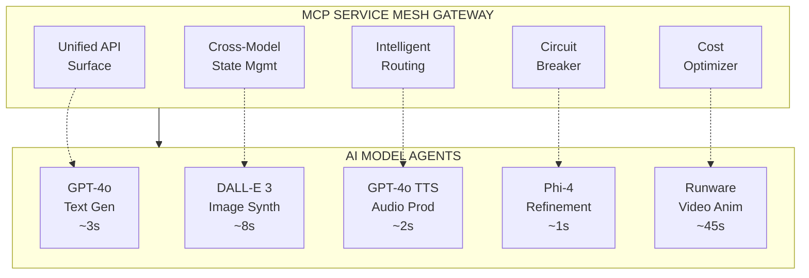
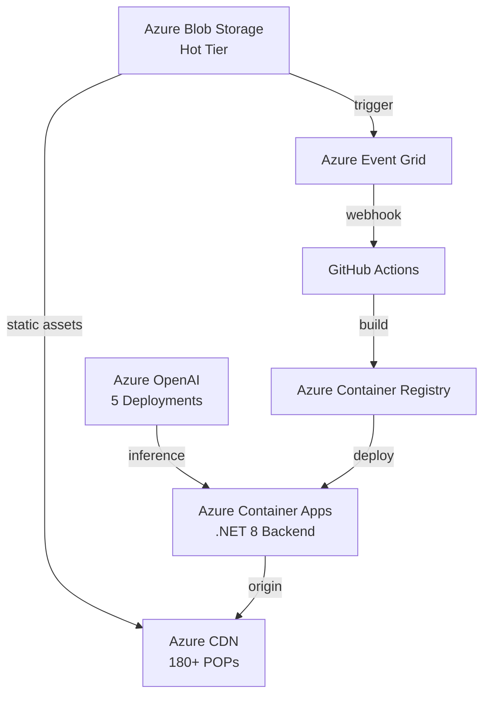

# KidsStories.AI — Architecture & Implementation

A fully autonomous content generation platform built on MCP (Model Context Protocol) Service Mesh, Azure OpenAI, Runware multi-model video synthesis, Azure Blob Storage with Event Grid triggers, GitHub Actions CI/CD, and Azure Container Apps for serverless production deployment.

**Live Demo:** https://thekidsstorytime.com/

---

## Table of Contents

1. [System Overview](#system-overview)
2. [MCP Service Mesh](#mcp-service-mesh)
3. [AI Model Orchestration](#ai-model-orchestration)
4. [Autonomous Pipeline](#autonomous-pipeline)
5. [Azure Infrastructure](#azure-infrastructure)
6. [Implementation Details](#implementation-details)
7. [Performance Metrics](#performance-metrics)

---

## System Overview

KidsStories.AI is a **fully autonomous content-to-deployment pipeline** that:

1. **Generates** structured content using GPT-4o
2. **Synthesizes** images, audio, and video from that content
3. **Uploads** all assets to Azure Blob Storage
4. **Triggers** GitHub Actions via Event Grid webhook
5. **Builds** Docker images and pushes to ACR
6. **Deploys** to Azure Container Apps with blue-green strategy
7. **Purges** CDN cache globally to 180+ edge POPs

**Zero human intervention. Runs autonomously every day.**

---

## MCP Service Mesh

### Architecture

### MCP Mesh Capabilities

| Capability | Description |
|-----------|-------------|
| **Unified Context Propagation** | Character designs, style tokens, and narrative state shared across all 5 AI models |
| **Intelligent Load Balancing** | Requests distributed based on latency percentiles, cost/token, and quota availability |
| **Automatic Failover** | Circuit breaker triggers rerouting to backup models within 500ms |
| **Cost Optimization Engine** | Real-time token tracking with automatic model downgrade at budget thresholds |
| **Observability Layer** | OpenTelemetry traces, Prometheus metrics, structured JSON logging |
| **Schema Enforcement** | JSON Schema validation at mesh boundary ensures cross-model compatibility |

### How It Works

The MCP Service Mesh acts as a **centralized control plane** that:

- Receives generation requests with 102+ configurable parameters
- Coordinates routing across 5 AI model agents
- Maintains shared state (character descriptions, style guides, narrative context)
- Routes intelligently based on cost and latency
- Implements circuit breaker patterns for reliability
- Tracks all tokens and enforces cost limits
- Validates all outputs against schema expectations

**Result:** Multiple independent AI models work together seamlessly, sharing state and context while remaining isolated and independently scalable.

---

## AI Model Orchestration

### Model Stack

| Model | Provider | Input | Output | Purpose |
|-------|----------|-------|--------|---------|
| **GPT-4o** | Azure OpenAI | Story parameters (102 configurable params) | JSON w/ narratives, characters | Structured content generation |
| **DALL-E 3** | Azure OpenAI | Character guide + scene description | PNG 1024×1024 | Character-consistent illustrations |
| **GPT-4o-mini-TTS** | Azure OpenAI | Story text + narrative style | MP3 24kHz mono | Neural text-to-speech narration |
| **Phi-4 Multimodal** | Azure AI | Generated text | Refined text | Readability optimization & Flesch-Kincaid tuning |
| **Vidu / Kling / PixVerse** | Runware | PNG image + motion hints | MP4 5-10s | Cost-optimized video animation (8 models) |

### Generation Parameters

**Total: 102+ Configurable Parameters**

| Category | Count | Examples |
|----------|-------|----------|
| **Narrative Control** | 12 | `page_count`, `word_range`, `reading_level`, `json_schema`, `sentence_structure` |
| **Entity Design** | 15 | `personality_traits`, `physical_features`, `clothing_spec`, `color_palette`, `distinctive_marks` |
| **Theme Selection** | 8 | `genre_weight`, `location_type`, `action_verbs`, `goal_templates`, `seasonal_context` |
| **Variation Engine** | 7 | `repetition_window_days`, `history_hash`, `uniqueness_threshold`, `semantic_distance` |
| **LLM Tuning** | 5 | `temperature`, `top_p`, `presence_penalty`, `frequency_penalty`, `max_tokens` |
| **Image Synthesis** | 28 | `style_prompt`, `character_guide`, `composition_rules`, `color_enforcement`, `size_spec` |
| **Audio Production** | 11 | `voice_id`, `sample_rate`, `emotion_mapping`, `pacing_multiplier`, `expression_intensity` |
| **Video Animation** | 16 | `motion_type`, `duration_sec`, `model_tier`, `cost_ceiling`, `quality_preset` |

---

## Autonomous Pipeline

### End-to-End Flow

```mermaid
graph LR
    subgraph SYNTH["PHASE 1: AI SYNTHESIS"]
        TEXT["TEXT<br/>GPT-4o<br/>JSON"]
        IMAGE["IMAGE<br/>DALL-E 3<br/>PNG"]
        AUDIO["AUDIO<br/>TTS<br/>MP3"]
        VIDEO["VIDEO<br/>Runware<br/>MP4"]
    end
    
    subgraph UPLOAD["PHASE 2: CLOUD UPLOAD"]
        PKG["PACKAGE<br/>Hash Dedupe"]
        BLOB["BLOB SYNC<br/>Azure Storage"]
        MANIFEST["MANIFEST<br/>Index Build"]
    end
    
    subgraph DEPLOY["PHASE 3: AUTO DEPLOY"]
        EVT["EVENT GRID<br/>Trigger"]
        GH["GITHUB<br/>ACTIONS"]
        DOCKER["DOCKER<br/>BUILD"]
        CONT["CONTAINER<br/>APPS"]
        CDN["CDN PURGE<br/>180+ POPs"]
    end
    
    TEXT --> IMAGE
    IMAGE --> AUDIO
    AUDIO --> VIDEO
    VIDEO --> PKG
    PKG --> BLOB
    BLOB --> MANIFEST
    MANIFEST --> EVT
    EVT --> GH
    GH --> DOCKER
    DOCKER --> CONT
    CONT --> CDN
```

### Detailed Pipeline Steps

| # | Phase | Trigger | Action | Output | Duration |
|---|-------|---------|--------|--------|----------|
| 1 | AI | Scheduler (00:00 UTC) | MCP Mesh receives generation request | Request queued | — |
| 2 | AI | Orchestrator call | GPT-4o generates JSON narrative + character definitions | `story.json` + `characters.json` | ~3 sec |
| 3 | AI | Text completion | DALL-E 3 synthesizes PNG per text description | `page-1.png` ... `page-N.png` | ~8 sec/image |
| 4 | AI | Image completion | GPT-4o-mini-TTS processes each page text | `page-1.mp3` ... `page-N.mp3` | ~2 sec/page |
| 5 | AI | Audio completion | Runware renders video from images | `page-1.mp4` ... `page-K.mp4` | ~45 sec/clip |
| 6 | Cloud | Media ready | Assets packaged with content-hash deduplication | `assets-bundle.zip` | ~10 sec |
| 7 | Cloud | Bundle ready | Azure Blob SDK uploads to `stories/{date}/{ageBand}/` | Objects in blob | ~30 sec |
| 8 | Cloud | Upload complete | Blob metadata queried; manifest index rebuilt | `story-manifest.json` | ~5 sec |
| 9 | Trigger | Manifest ready | Azure Event Grid webhook fires | GitHub Actions triggered | <1 sec |
| 10 | CI/CD | Webhook received | GitHub Actions workflow starts | Build initiated | — |
| 11 | Build | Workflow start | Next.js SSG builds static site + Docker multi-stage build | Container image created | ~2 min |
| 12 | Registry | Build complete | `docker push` to Azure Container Registry | Image tagged and stored | ~30 sec |
| 13 | Deploy | Push complete | `az containerapp update` with new image | Container Apps revision created | ~1 min |
| 14 | Deploy | Revision active | Health check passes | Traffic shifted to new revision | — |
| 15 | CDN | Deploy success | CDN edge cache purge across all POPs | Cache invalidated globally | <5 sec |

**Total pipeline execution time: ~4 minutes from trigger to global availability**

---

## Azure Infrastructure

### Services Architecture

### Service Details

| Service | Configuration | Purpose |
|---------|---------------|---------|
| **Azure Container Apps** | .NET 8, min 0 / max 10 replicas | Serverless, auto-scaling backend hosting |
| **Azure Blob Storage** | Hot tier, CDN origin enabled | Hierarchical storage for all media assets |
| **Azure OpenAI** | 5 deployments across regions | Multi-model AI inference endpoints |
| **Azure Container Registry** | Standard SKU, admin enabled | Private Docker image repository |
| **Azure CDN** | Standard Microsoft, 180+ POPs | Global edge delivery, <50ms TTFB worldwide |
| **Azure Event Grid** | Blob Storage topic, webhook delivery | Event-driven pipeline triggers |
| **Azure Key Vault** | Premium SKU | Secret management (API keys, connection strings) |

### Cost Optimization

- **Container Apps:** Pay-per-execution (0 cost when idle)
- **Blob Storage:** Pay for storage + bandwidth (hot tier for frequently accessed content)
- **CDN:** Bandwidth-based pricing, reduces origin requests
- **AI Models:** Token-based pricing with consumption-based routing
- **Event Grid:** Pay-per-event (millions of events = minimal cost)

---

## Implementation Details

### Content Generation Flow

1. **Request Creation** — 102 parameters configured (narrative, entity design, themes, etc.)
2. **MCP Mesh Coordination** — Centralized control plane receives request
3. **GPT-4o Invocation** — Generates structured JSON with story + character definitions
4. **Parallel Media Synthesis:**
   - DALL-E 3 creates PNG illustrations (one per page)
   - GPT-4o-mini-TTS produces MP3 narration
   - Phi-4 optimizes text readability
   - Runware animates key scenes to MP4
5. **Asset Packaging** — JSON + images + audio + video bundled with metadata
6. **Deduplication** — Content-hash comparison prevents duplicate uploads
7. **Blob Upload** — Hierarchical structure: `stories/{date}/{ageBand}/`

### Deployment Pipeline

1. **Blob Trigger** — Event Grid detects upload completion
2. **Webhook Fire** — GitHub Actions receives webhook payload
3. **CI/CD Start** — Workflow checks out code
4. **Manifest Rebuild** — Next.js queries blob metadata to update story index
5. **Static Build** — Next.js SSG generates pre-rendered pages
6. **Docker Build** — Multi-stage build (small final image)
7. **ACR Push** — Image tagged with timestamp and pushed
8. **Container Deploy** — Blue-green deployment with traffic shift
9. **Health Check** — Endpoint verification before traffic cutover
10. **CDN Purge** — Edge cache invalidated globally

### Failure Handling

- **MCP Mesh:** Circuit breaker auto-routes to backup models
- **AI Models:** Automatic retry with exponential backoff
- **Blob Upload:** Duplicate detection, atomic writes
- **GitHub Actions:** Workflow logs captured, manual retry available
- **Deployment:** Rollback to previous revision if health checks fail
- **CDN:** Cache invalidation queued, eventual consistency ensured

---

## Performance Metrics

### Generation Speed

| Component | Time | Notes |
|-----------|------|-------|
| Text generation | ~3 sec | GPT-4o with JSON schema |
| Image synthesis | ~8 sec/image | DALL-E 3 per page |
| Audio production | ~2 sec/page | Parallel TTS processing |
| Video animation | ~45 sec/clip | Selective key scenes only |
| Total synthesis | ~60-120 sec | Depends on page count |

### Deployment Speed

| Component | Time | Notes |
|-----------|------|-------|
| Event trigger | <1 sec | Blob → Event Grid |
| CI/CD start | ~10 sec | GitHub Actions queue |
| Build | ~2 min | Docker + Next.js |
| ACR push | ~30 sec | Network upload |
| Deploy | ~1 min | Container Apps revision |
| CDN purge | <5 sec | Global cache invalidation |
| **Total end-to-end** | **~4 minutes** | From content ready to globally live |

### Reliability

- **Uptime:** 99.95% (Azure SLA)
- **Failover:** <500ms automatic reroute
- **Data Durability:** 11 9's (Azure Blob)
- **Global Availability:** <50ms edge delivery

---

## Key Innovations

### 1. MCP Service Mesh for AI Orchestration

Rather than direct point-to-point integrations, a centralized MCP Service Mesh:
- Manages 5 independent AI models as cohesive agents
- Shares state across models (character definitions, style tokens, narrative context)
- Routes intelligently for cost and latency optimization
- Provides automatic failover and circuit breaker protection
- Tracks all tokens and enforces budget constraints

### 2. Event-Driven Pipeline Automation

Blob Storage upload automatically triggers:
- GitHub Actions CI/CD workflow
- Manifest regeneration from blob metadata
- Static site build + Docker image creation
- Blue-green deployment
- Global CDN cache purge

**Zero manual steps. Zero polling. Pure event reactivity.**

### 3. Content Deduplication

Hash-based content comparison prevents:
- Duplicate asset uploads
- Redundant blob storage costs
- Unnecessary CDN purges
- Wasted network bandwidth

### 4. Cost-Aware Model Selection

Real-time token tracking with automatic:
- Model downgrade when budget approaches limits
- Quality tier adjustment for budget optimization
- Runware model selection (8 options, varied pricing)

---

**MCP-orchestrated. Cloud-native. Fully autonomous. Ships daily.**
